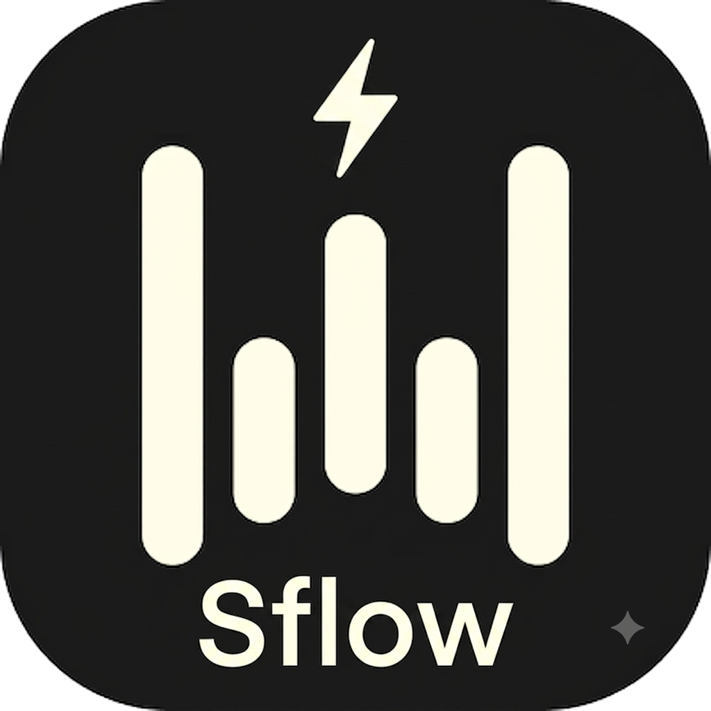

<p align="center">
  
</p>

<h1 align="center">SFlow</h1>

<p align="center">
  <strong>Private, on-device voice-to-text for macOS. Hold a hotkey, speak, and your words appear wherever your cursor is.</strong>
</p>

<p align="center">
  
  
  
  
  
</p>

---

## What is SFlow?

SFlow is a **system-wide voice-to-text tool** for macOS. Hold a hotkey, speak, release — your words appear wherever your cursor is. Any app, any text field.

**By default it runs entirely on your Mac.** Transcription uses a local Whisper Turbo /
Parakeet model (Apple MLX) — no account, no API key, no audio leaving your machine, $0.
A Groq cloud model is available as an optional fallback for machines that can't run the
local engine. Built as a free, private alternative to [Wispr Flow](https://wispr.com) ($15/month).

### Features

- **On-device by default** — local Whisper Turbo (best accuracy) or Parakeet (fastest),
  offline, private, free. Parakeet ships inside the app; Whisper Turbo is an optional
  in-app download with a progress bar.
- **Native macOS app** — lives in the menu bar, no terminal, starts with your Mac.
- **System-wide dictation** — works in any app (VS Code, Chrome, Slack, Notes, …).
- **Three recording modes** — hold `Ctrl+Alt` (push-to-talk), double-tap `Ctrl`
  (hands-free), or an optional mouse button.
- **Floating pill** — minimal overlay with a live audio visualizer; it never steals focus
  (native macOS APIs). A distinct cloud glyph appears if a dictation ever falls back to the cloud.
- **Optional AI cleanup** — remove fillers and fix punctuation via Groq, OpenRouter, or a
  fully **local** model. Always fail-open: if it errors, you get the raw transcript.
- **Native Hub** (`Cmd+Shift+H`) — light+dark dashboard for history (filter by app / model /
  date), personal dictionary, snippets, transforms, insights, and settings.
- **Bilingual UI** — English and Spanish, following your system language or a manual override.
- **Local SQLite history** — every transcription saved on your Mac, and it self-heals if the file is ever corrupted.
- **Guided first-run** — walks you through the mic and the two macOS permissions with a live
  mic test and "granted ✓" polling. No config files to edit.

---

## Quick Start

### Prerequisites

- macOS 15+, Apple Silicon (for the local engine)
- Python 3.12 (MLX does not install on 3.14)
- [Homebrew](https://brew.sh)
- A Groq API key is **optional** — only for the cloud model or cloud AI cleanup. The
  default install needs no key.

### Install (Desktop App — recommended)

```bash
git clone https://github.com/NXT-Solutions-Tech/Sflow.git
cd Sflow

# System dependency (audio capture)
brew install portaudio

# Python environment (must be 3.12 for MLX)
python3.12 -m venv venv
source venv/bin/activate
pip install -r requirements.txt

# Build the .app (bundles the Parakeet weights → ~1.1GB, fully offline)
bash build.sh

# Install (IMPORTANT: use ditto, not cp -r)
ditto dist/SFlow.app /Applications/SFlow.app
xattr -cr /Applications/SFlow.app
```

Open SFlow from Spotlight or `/Applications`. On first launch a short wizard tests your
microphone and walks you through the two macOS permissions (Accessibility, so it can type
for you; Input Monitoring, so it can hear the hotkey). The API-key step only appears if you
picked a cloud model — otherwise choose **"Continuar sin conexión"** and dictate entirely
on your Mac.

### Install (Dev Mode)

```bash
git clone https://github.com/NXT-Solutions-Tech/Sflow.git
cd Sflow
brew install portaudio
python3.12 -m venv venv
source venv/bin/activate
pip install -r requirements.txt
python3 main.py            # no API key needed for the default local engine
```

To use a cloud model or cloud AI cleanup, `cp .env.example .env` and paste your
`GROQ_API_KEY` (or `OPENROUTER_API_KEY`). In a packaged `.app`, `.env` lives at
`~/Library/Application Support/SFlow/.env`, and keys are stored in the macOS Keychain.

---

## Usage

| Action | Shortcut |
|--------|----------|
| **Push-to-talk** | Hold `Ctrl+Alt`, speak, release |
| **Hands-free** | Double-tap `Ctrl` to start, tap `Ctrl` to stop |
| **Command Mode** (opt-in) | Hold `Ctrl+Shift`, speak an instruction → transforms the selected text |
| **Transforms** | `Option+1…8` — apply the Nth custom transform to the selection |
| **Open Hub** | `Cmd+Shift+H`, or menu bar → "Abrir Hub" |
| **Paste last transcript** | `Cmd+Ctrl+V` |
| **Pause / resume** | Menu bar → "Pausar SFlow" |
| **Start with macOS** | Toggle in the menu bar |

### Pill states

| State | Visual |
|-------|--------|
| Idle | Small pill with logo |
| Recording | Expanded pill with animated audio bars |
| Processing | Spinning dots |
| Done | Green checkmark |
| Done (cloud fallback) | Amber cloud glyph — the audio went to the cloud |
| Error | Red X + an in-app toast explaining what to do |

---

## macOS Permissions

Grant these in System Settings → Privacy & Security (the first-run wizard links you straight there):

1. **Accessibility** — for global hotkeys and auto-paste
2. **Microphone** — for audio capture
3. **Input Monitoring** — for the keyboard listener

> Note: without a Developer ID signature, macOS re-checks Accessibility on every rebuild.
> If dictation stops typing after a rebuild, re-grant Accessibility (the wizard reopens to
> that exact step). See [CLAUDE.md](CLAUDE.md).

---

## Architecture

```
Hotkey (pynput) → Audio (sounddevice) → local Whisper/Parakeet (MLX) [→ Groq fallback]
                        │                          │
                  Audio bars (QPainter)     smart commands → LLM cleanup → snippets
                        │                          │
             Floating pill (PyQt6+PyObjC)   Auto-paste (CGEvent) + SQLite + native Hub
```

- **PyObjC/AppKit** — native floating window that never steals focus.
- **Qt QueuedConnection** — thread-safe signals from the pynput thread to the UI.
- **CGEvent keystrokes** — default paste path; never touches your clipboard.
- **ModelManager** — bundle-first weight resolution, no implicit downloads.

---

## Troubleshooting

| Problem | Solution |
|---------|----------|
| Pill doesn't appear | Grant Accessibility to your terminal/app |
| Pill steals focus | Verify PyObjC: `python -c "import AppKit"` |
| Audio not captured | Check Microphone permission + `brew list portaudio` |
| Records but no text | Pick/download a local model in Ajustes → Modelo, or add a Groq key |
| Hotkey does nothing | Input Monitoring revoked — the wizard's step re-grants it |
| Paste stops after a rebuild | Re-grant Accessibility (ad-hoc signature changed) |
| .app crashes (segfault) | Reinstall with `ditto`, not `cp -r` |
| .app blocked by macOS | `xattr -cr /Applications/SFlow.app` |

For the full development guide, gotchas, and the model catalog, see [CLAUDE.md](CLAUDE.md)
and [CHANGELOG.md](CHANGELOG.md).

---

## License

MIT — see [LICENSE](LICENSE). This is a fork; the upstream MIT copyright is preserved.
